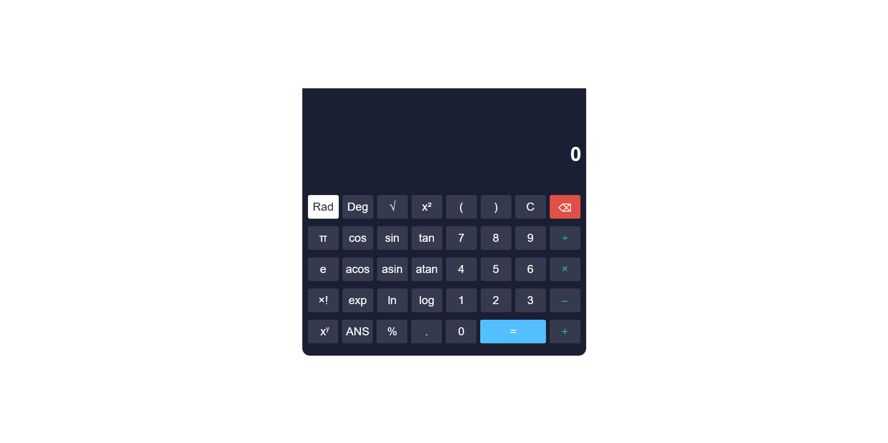

# Scientific Calculator 🧮



<p align="center">
  
  
  
</p>

🇧🇷 Você não fala inglês? [Clique aqui](README.pt.md) para ler a versão em português.

## 🚀 About the Project

This project is an effective web application that shows the practical application of HTML, CSS and especially JavaScript. It allows you to perform complex calculations in an easy and intuitive way. This project was developed based on the video ["Create a Scientific Calculator With JavaScript, HTML and CSS | JavaScript Project For Beginners"](https://www.youtube.com/watch?v=52GL_cfLBYs) from the Code Explained channel.

## 🛠️ Technologies Used

- HTML
- CSS
- JavaScript

## ⚙️ Installation and Use

To install and use this project, follow these steps:

1. Clone this repository on your local machine
```bash
git clone https://github.com/artur-duart/scientific-calculator
```
2. Navigate to the main folder of the project
```bash
cd scientific-calculator
```
3. Open the `index.html` file in your browser

Now you can access the project in your browser.

## 🤝 Contributing

Contributions are always welcome! If you have any suggestions or corrections, feel free to open an issue or submit a pull request.

## 📝 License

This project is licensed under the MIT License. See the [LICENSE](LICENSE) file for more details.

---

Made with 💜 by <a href="https://www.linkedin.com/in/artur-duart/">Artur Duarte</a> :wave:
